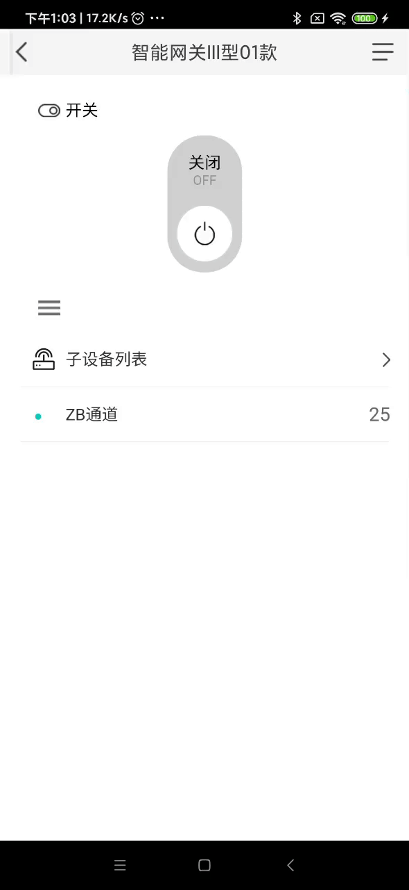
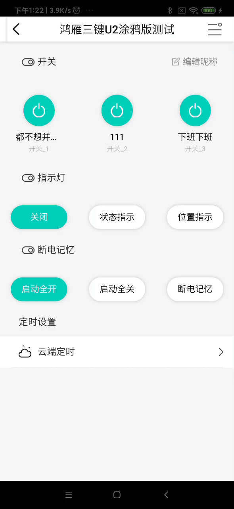
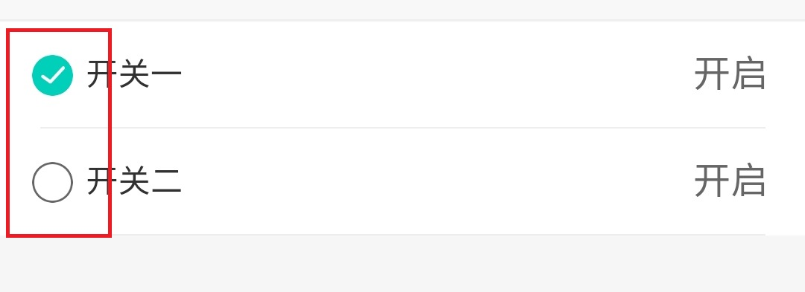

# 主按钮（电源按钮）

### 导入注册及使用
<!-- style='background-color:#f9f2f4' -->

 View Code

    <template>
        <Main-Power-Switch :status="dev_props.powerstate" @event="power_event"></Main-Power-Switch>
    </template>
    

    
    
### 说明
|  类型   | 名称  | 值  | 值类型 | 必填  |
|  ----  | ----  |  ----  | ----  | ----  |
| 属性  | status | 0 或 1 | Number | 是 |
| 事件  | event | 执行函数 | Function | 是 |

---

# 圆形普通电源按钮

### 导入注册及使用
<!-- style='background-color:#f9f2f4' -->

 View Code

    <template>
        <Round-Switch type="power" :state="enable" @event="changeSwitch"></Round-Switch>
    </template>
    

    
    
### 说明
|  类型   | 名称  | 值  | 值类型 | 必填  |
|  ----  | ----  |  ----  | ----  | ----  |
| 属性  | state | 0 或 1 | String | 是 |
| 事件  | event | 执行函数 | Function | 是 |

---

# 椭圆形普通电源按钮

### 导入注册及使用
<!-- style='background-color:#f9f2f4' -->

 View Code

    <template>
        <Round-Edges-Transverse-Rectangle :state="dev_props.indicator === 0 ? 1 : 0" @event="changeSwitch(0,'indicator')" title="关闭" ></Round-Edges-Transverse-Rectangle>
    </template>
    

    
    
### 说明
|  类型   | 名称  | 值  | 值类型 | 必填  |
|  ----  | ----  |  ----  | ----  | ----  |
| 属性  | state | 0 或 1 | String | 是 |
| 属性  | title | "按钮标题" | String | 是 |
| 事件  | event | 执行函数 | Function | 是 |

---

# Check按钮

### 导入注册及使用
<!-- style='background-color:#f9f2f4' -->

 View Code

    <template>
        <Chick-Switch :enable="enable"  @state="setState" @event="switchEvent"></Chick-Switch>
    </template>
    

    
    
### 说明
|  类型   | 名称  | 值  | 值类型 | 必填  | 说明 |
|  ----  | ----  |  ----  | ----  | ----  | --- |
| 属性  | enable | 0 或 1 | String | 是 |
| 事件  | @state | 执行函数 | Function | 是 | check点击回调返回最新状态