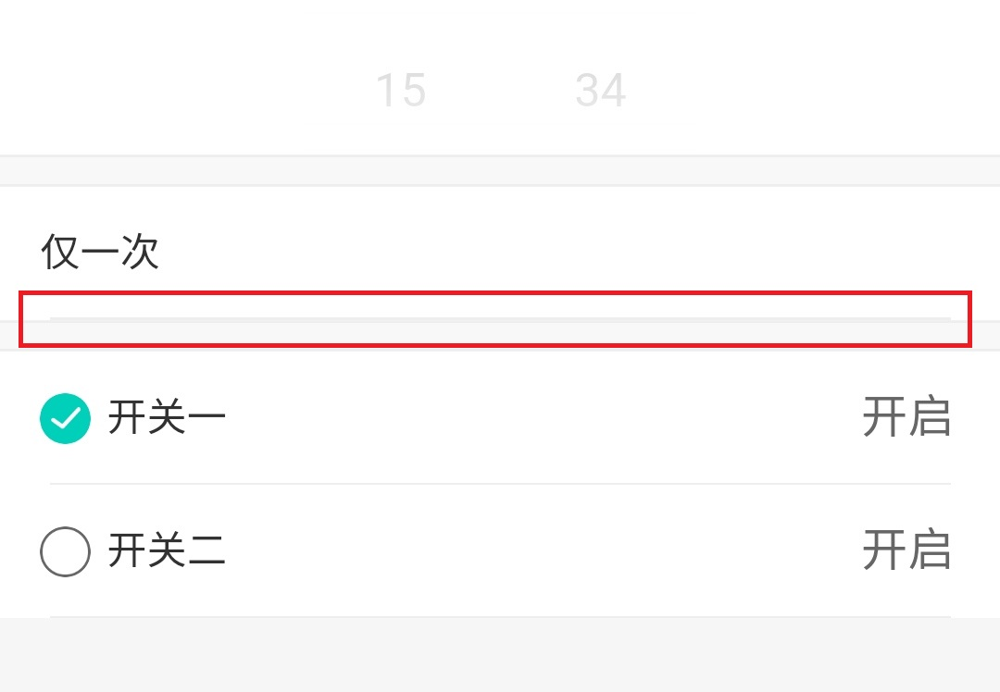
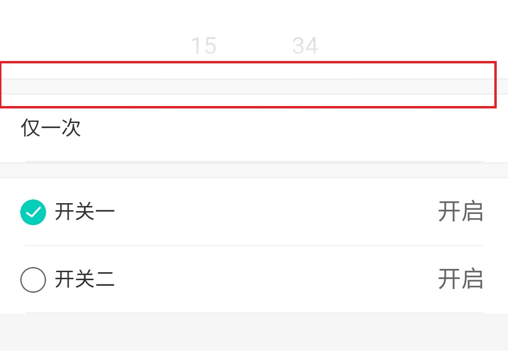

# 底部横线

### 导入注册及使用
<!-- style='background-color:#f9f2f4' -->

 View Code

    <template>
        

            <InsideLine-DividingStrip></InsideLine-DividingStrip>
        

    </template>
    

    
    
### 说明

|  类型   | 名称  | 值  | 值类型 | 必填  | 说明 |
|  ----  | ----  |  ----  | ----  | ----  | ---- |

---

# 灰色分隔条

### 导入注册及使用
<!-- style='background-color:#f9f2f4' -->

 View Code

    <template>
        <Gray-Dividing-Strip></Gray-Dividing-Strip>
    </template>
    

    
    
### 说明

|  类型   | 名称  | 值  | 值类型 | 必填  | 说明 |
|  ----  | ----  |  ----  | ----  | ----  | ---- |