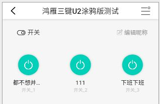

# 模块化容器

### 导入注册及使用
<!-- style='background-color:#f9f2f4' -->

 View Code

    <template>
        <Module-Frame titleName="开关" titleImg="title_switch.png" type="normal">
          <Main-Power-Switch :status="dev_props.powerstate" @event="power_event"></Main-Power-Switch>
        </Module-Frame>
    </template>
    

    
    
### 说明
|  类型   | 名称  | 值  | 值类型 | 必填  | 说明 |
|  ----  | ----  |  ----  | ----  | ----  | ---- |
| 属性  | titleName | 模块标题 | String | 是 |      |
| 属性  | rightOption | true,false | Bool | 否 |      |
| 属性  | titleImg | 模块icon图片名 | String | 是 |  icon 图片路径放入 assets/images/icon/module/ 目录下   |
| 属性  | type | normal(有Icon)、noIcon(隐藏Icon) | String | 是 |     |
| 事件  | @rightOptionEvent | rightOption事件 | Function | 当rightOption为true时可填 |     |

---

# 缓动容器

### 导入注册及使用
<!-- style='background-color:#f9f2f4' -->

 View Code

    <template>
        <Animation-Frame>
            

                主页
            

        </Animation-Frame>
    </template>
    

    
    
### 说明
    此组件标签内可以嵌套组件

|  类型   | 名称  | 值  | 值类型 | 必填  | 说明 |
|  ----  | ----  |  ----  | ----  | ----  | ---- |

