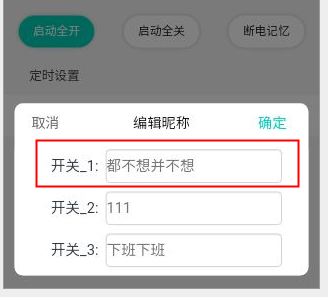

# 普通列项（带title、value、图标、checkButton、右箭头）
### 图片预留位置

### 导入注册及使用
<!--  style='background-color:#f9f2f4' -->

 View Code

    <template>
       <List-Item type="normal" title="标题" value="显示值" @click.native="chooseWeek"></List-Item>
    </template>
    

    
    
### 说明
|  类型   | 名称  | 值  | 值类型 | 必填  | 说明 |
|  ----  | ----  |  ----  | ----  | ----  | ---- |
| 属性  | type | "check","imgItem","normal" | String | 是 | "check"用于带check按钮的Item，"imgItem"用于带自定义图标的Item，"normal"默认样式，不带按钮也不带图标 |
| 属性  | title | "标题" | String | 是 | |
| 属性  | value | "值" | String | 是 |
| 属性  | bottomLine | true,false | bool | 否 |
| 属性  | arrow | true,false | bool | 否 |
| 属性  | iconName | 图片名 | String | 当type为imgItem时为必填其他不用填 | 图片放入地址：../../assets/images/icon/module/${imageUrl}.png |
| 属性  | enable | 0,1 | String | 当type为check时为必填其他不用填 |
| 事件  | @click.native="" | 组件原生点击执行函数 | Function | 是 |

-----

# Input列项
### 图片预留位置

### 导入注册及使用
<!--  style='background-color:#f9f2f4' -->

 View Code

    <template>
        <List-Item-Input v-for="(value,key,index) in dev_props.childPropName" :key="index" :title="value.propName" :placeholder="value.nickName"  @input="changePropName(key,$event)"></List-Item-Input>
    </template>
    

    
    
### 说明
    输入框只允许输入中英文，并最多输入15位字符
|  类型   | 名称  | 值  | 值类型 | 必填  | 说明 |
|  ----  | ----  |  ----  | ----  | ----  | ---- |
| 属性  | title | "标题" | String | 是 | |
| 属性  | placeholder | "占位文字" | String | 是 | |
| 事件  | @input | @input方法 | Function | 是 | 该事件为输入框输入的回调事件 |

