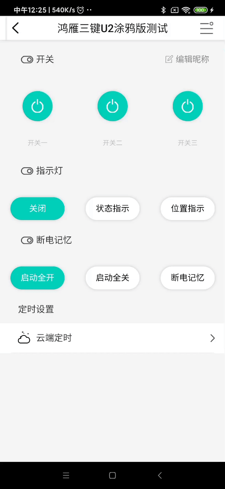
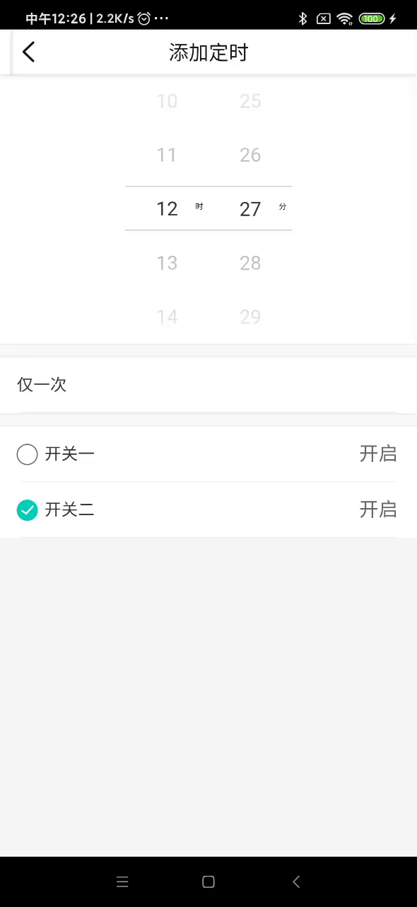

# 模态框底部弹窗

### 导入注册及使用
<!--  style='background-color:#f9f2f4' -->

 View Code

    <template>
        <<List-Modal title="编辑昵称" @confirm="changeNameConfirm" @cancel="changeNameCancel">
          <List-Item-Input v-for="(value,key,index) in dev_props.childPropName" :key="index" :title="value.propName" :placeholder="value.nickName"  @input="changePropName(key,$event)"></List-Item-Input>
        </List-Modal>
    </template>
    

    
    
### 说明
    此组件标签内可以嵌套组件
|  类型   | 名称  | 值  | 值类型 | 必填  | 说明 |
|  ----  | ----  |  ----  | ----  | ----  | ---- |
| 属性  | title | "标题" | String | 是 | |
| 事件  | @confirm | @confirm方法 | Function | 是 | 该事件为模态框点击确定事件 |
| 事件  | @cancel | @cancel方法 | Function | 是 | 该事件为模态点击取消事件 |
