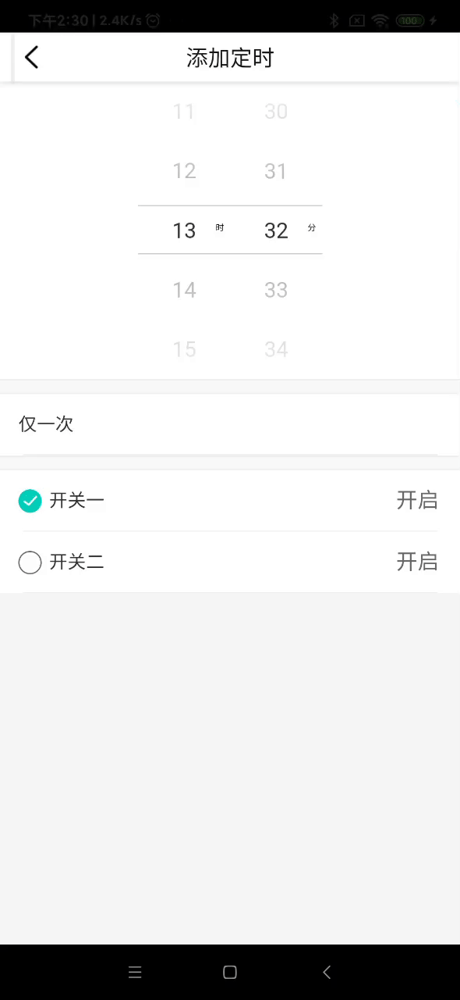
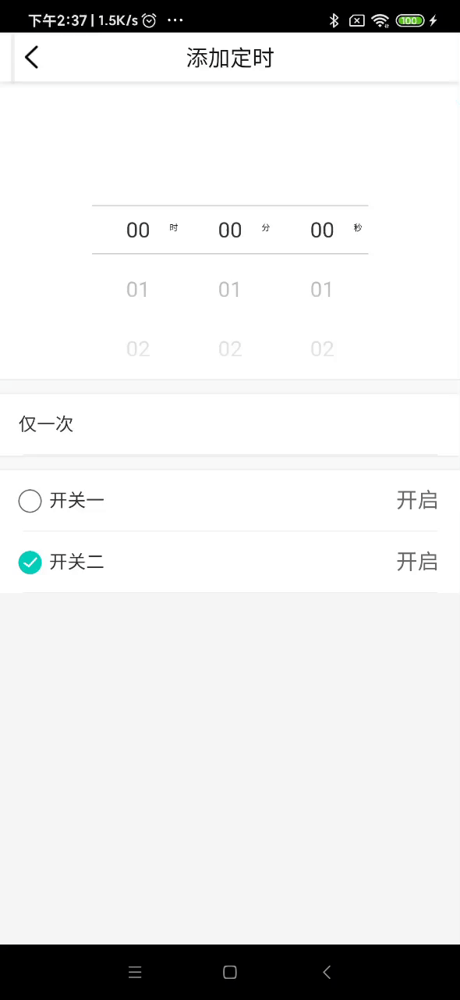

# 定时倒计时选择插件

### 导入注册及使用
<!-- style='background-color:#f9f2f4' -->

 View Code

    <template>
        <Select-Panel setTypes="1" :chooseCloudHour="cloudDataInfo.time.hour" :chooseCloudMin="cloudDataInfo.time.min" @selectTimeHour="selectTimeHour_cloud" @selectTimeMin="selectTimeMin_cloud"></Select-Panel>
    </template>
    

    
    
### 说明
    此组件标签内可以嵌套组件

|  类型   | 名称  | 值  | 值类型 | 必填  | 说明 |
|  ----  | ----  |  ----  | ----  | ----  | ---- |
|  属性  | setTypes | 0,1 | String | 是 | 0为倒计时1为定时 |
| 属性 | chooseCloudHour | 0-23 | String |当setTypes为0时 必选 | 此属性为设置定时列表初始小时数 |
| 属性 | chooseCloudMin | 0-59 | String |当setTypes为0时 必选 | 此属性为设置定时列表初始分钟数 |
| 事件 | @selectTimeHour | 小时选择时回调事件 | Function | 是 | 选择小时列表回调的事件 |
| 事件 | @selectTimeMin | 分钟选择时回调事件 | Function | 是 | 选择分钟列表回调的事件 |